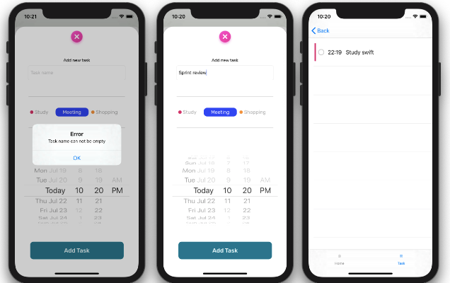

### ToDo App

Create your reminders easily
 
 
### About the app

Free browse movies app for finding trending or upcoming movies.
Also you can search for movies by their genre. Possibility to find current rating of movies, and to see more details about movie you find.
 
 

 
 

|      | Registration Screens     |
|---                  |---   |
| Splash Screen                   | Welcome to my app. Enjoy exploring |
| Registration Screen             | You can registrate to app with email and password |
| Login Screen                    | You can login to app with email and password |

## Concepts used in registration

* Firebase authentication
* UI: For UI I use both, programmatically, and storyboards.
* TODO: Need to implement sign in with google account and facebook account
 
 

 
 
### App Flow

App uses core data for saving data localy
- For title app uses user email
- If user don't have any reminders we empty screen to show
- If user have some reminders, UITableView will be shown with that reminders
- User can see all categories listed in UICollectionView in CategoryViewController
- Also user can see reminders if he click on some category from CategoryViewController
- User can checked or unchecked every reminder

|      | Main Screens     |
|---                  |---   |
| Home View Controller            | User can see table of all reminders |
| Category View Controller        | User can see list of all categories inside app |

## Concepts used in main screens

* Saved all user reminders in core data
* Use notification observer if something change for reminder
* Set programmatically home view controller, if user don't have reminders, One approuch, we also have another approuch with table view
 
 

 
 
### App Logic

- User can add new reminder.
- User can edit reminder.
- User can delete reminder.
- App have correct validation for adding new reminder
- Use core data for saving reminders
- Use Firebase Analythics 
- Use Observers for communication

